# Mini_Project-Basic_Linux_Commands
Darey.io project

<h1>Linux Commands Deep Dive</h1>
<h2 id="now-that-you-have-a-client-terminal-and-have-accessed-your-remote-server,-what-next?">Now that you have a client terminal and have accessed your remote server, what next?</h2>

For the next couple of projects, you will learn a lot about Linux commands, therefore, its time to get your hands dirty.

<h2 id="what-is-a-linux-command?">What is a Linux Command?</h2>

A Linux command refers to a program or utility that runs in the command-line interface (CLI). The CLI is a text-based environment where you interact with the system by typing commands.

Linux commands are executed by entering text in the Terminal and pressing Enter. These commands enable you to perform a wide range of tasks, including installing packages, managing users, manipulating files and directories, configuring system settings, and more.

The general syntax of a Linux command is as follows: (<em>Try the commands used as example as you read along</em>)

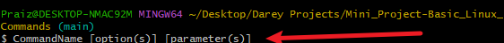

A command may consist of options and parameters, but they are not always required. Here are the key components of a command:

<strong>CommandName:</strong> This represents the action or task you want to perform using the command. For example if you wish to list files in a folder, you basically use the <code>ls</code> command.

<strong>Option or Flag:</strong> An option modifies the behavior of a command. It is typically preceded by a hyphen (-) or double hyphen (--) and can be used to customize the command's functionality. For example, if I want to show extra information for each listed file, i will run the command <code>ls -l</code>

<strong>Parameter or Argument:</strong> A parameter provides specific information or data required by the command to execute the desired action. For example, if I want to create a new directory (or folder), I will use the <code>mkdir</code> command. The parameter will be the name of the directory in which I will pass to it. <code>mkdir photos</code> will create a <strong>photos</strong> directory.

It's important to note that Linux commands are case-sensitive, so you need to enter them exactly as they are spelled and formatted.

<h2 id="manipulating-files-and-directories-on-linux">Manipulating files and directories on Linux</h2>

Most of your time on Linux will be working with files and directories. Hence, it is very important to know how to work with them. In the next section, we will focus on different commands that covers different use cases of manipulating files and directories on linux.

<h5>The <code>sudo</code> command</h5>

In Linux, some actions need special permission to be carried out, like creating files in certain areas or changing important system settings. This is where the sudo command comes into play. "sudo" stands for "superuser do," and it allows you to run commands with the security privileges of another user, typically the superuser or "root."

<strong>Why Use sudo?</strong>

<strong>Security:</strong> It helps in keeping the system secure by limiting access to powerful commands.
<strong>Tracking:</strong> It logs who executed which command, adding a layer of accountability.

<strong>How sudo Works:</strong>

When you precede a command with sudo, Linux asks for your password. Once you enter it correctly, you can run commands as if you were the system's superuser for a short period (usually 15 minutes). This means you won't need to enter your password for each sudo command within this timeframe.

<strong>Creating a Folder with sudo:</strong>

Sometimes, you need superuser privileges to create a folder in certain locations on your system. Here's how you can do it:

<ol>
<li>

Open your terminal, and connect to your linux server using SSH.

</li>
<li>

Try creating a folder in a restricted location. For example, let's try to create a folder named "<strong>example</strong>" in the <code>/root</code> directory, which is reserved for the root user:

</li>
</ol>

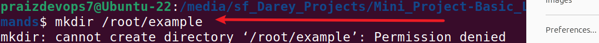

3. Observe the failure. You'll likely encounter a permission denied error like this:

This error occurs because regular users do not have the necessary permissions to create directories in /<code>root</code>.

<ol start="4">
<li>Use sudo to Successfully Create the Folder</li>

<strong>Press Enter:</strong> Because you now included <code>sudo</code> in the command. It executes successfully without error. In some cases, you may be prompted to provide a password. If it does, and you know the password, simply provide it and the elevated permission will be used to create the folder.

<strong>Verify the folder's creation:</strong> The command should succeed without errors. You can check the folder's existence by listing the contents of <code>/root</code> using the <code>ls</code> command. It should include the newly created folder in the output on your screen. Though you may need to use sudo again to view the contents of this directory:

<strong>Note:</strong> Using sudo gives you significant power over your system, including the ability to change or delete crucial system files. So, it's wise to use it carefully and only when necessary.

<h5>pwd command</h5>

Use the <code>pwd</code> command to find the path of your current working directory. Simply entering <code>pwd</code> will return the full current path – a path of all the directories that starts with a forward slash (/). For example, <code>/home/username</code>.

The <code>pwd</code> command uses the following syntax:

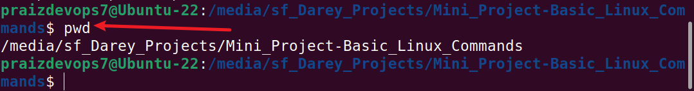

<h5>The Linux directory structure.</h5>

After learning about the use of sudo, it's crucial to understand how the Linux filesystem is organized. This knowledge is fundamental when navigating through the system, managing files, and understanding where different types of files and directories reside.

<h5>The Root Directory ("/")</h5>

At the top of the Linux filesystem hierarchy is the root directory, denoted by a single slash <code>(/)</code>. Unlike Windows, which uses different drives (<code>C</code>, <code>D</code>:, etc.), Linux organizes everything starting from this root directory. Under <code>/</code>, you'll find various directories with specific purposes:

<strong>/bin:</strong> Essential user command binaries (programs) that need to be available to all users are stored here (e.g., ls, cp).
<strong>/etc:</strong> Configuration files for the system can be found in here..
<strong>/home:</strong> Personal directories for users.
<strong>/root:</strong> The home directory for the root user.
<strong>/var:</strong> Variable data like logs.
<strong>/usr</strong>: Secondary hierarchy for user data; contains majority of user utilities and applications.

You should use the <code>ls</code> command to explore them and get some experience navigating Linux.

<h5><code>cd</code> command</h5>

To navigate through the Linux files and directories, use the <code>cd</code> command.

Let’s say want to navigate to the root filesystem on your server. Remember, the root filesystem is like the "C:" drive on windows. It is the starting point of folders and it is represented by <code>/</code> on Linux. To go to the root filesystem, simply type;

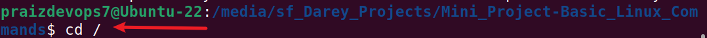

To confirm that you are there, use the <code>pwd</code> command to check where you are.

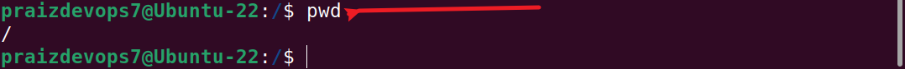

To list the files and directories on in the root filesystem, simply type <code>sudo ls -l</code>.

Below is my output, but yours may be slightly different

If I want to navigate to any of the directories in the output, lets say the <code>usr</code>, then I can use the <code>cd</code> command to enter that directory.

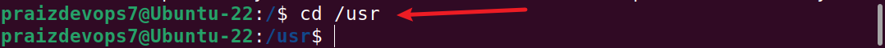

Notice that the <code>usr</code> has a <code>/</code> prefix. On Linux, navigation starts from the root.

<strong>Side Hustle Task 1 :</strong>

<ul>
<li>Create a directory called <code>photos</code> inside the <code>/usr</code> directory</li>

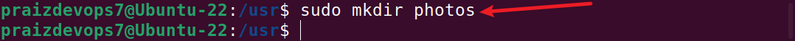
<li>navigate into the <code>photos</code> directory</li>

<li>Create 3 more random directories inside the <code>photos</code> directory</li>

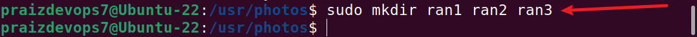
<li>Show the newly created directories on the terminal</li>

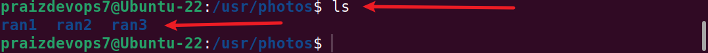
<li>Navigate into one of them</li>

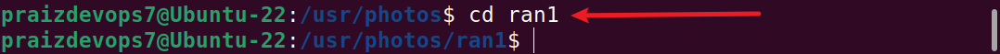
<li>Show the full path where you currently are on the screen</li>

</ul>
<h5>ls command</h5>

The <code>ls</code> command lists files and directories. Running it without a flag or parameter will show the current working directory’s content.

To see other directories’ content, type <code>ls</code> followed by the desired path. For example, to view files in the Documents folder, enter:

ls /home/ubuntu/Documents

Here are some options you can use with the ls command:

<pre class="relative"><button type="button" class="absolute right-2 top-1.5 flex items-center gap-1 rounded-md border border-blue-300 bg-inherit px-2 py-1.5 text-sm font-medium text-blue-300"><svg width="21" height="21" viewBox="0 0 21 21" fill="none" xmlns="http://www.w3.org/2000/svg"><path d="M15.3677 8.03125L17.3677 8.03125C17.92 8.03125 18.3677 8.47896 18.3677 9.03125L18.3677 16.0312C18.3677 17.1358 17.4722 18.0312 16.3677 18.0312L9.36768 18.0312C8.81539 18.0312 8.36768 17.5835 8.36768 17.0312L8.36768 15.0312M10.3677 2.03125L4.36768 2.03125C3.26311 2.03125 2.36768 2.92668 2.36768 4.03125L2.36768 10.0312C2.36768 11.1358 3.26311 12.0312 4.36768 12.0312L10.3677 12.0312C11.4722 12.0312 12.3677 11.1358 12.3677 10.0312L12.3677 4.03125C12.3677 2.92668 11.4722 2.03125 10.3677 2.03125Z" stroke="currentColor" stroke-width="1.5" stroke-linecap="round"></path></svg>Copy</button><code>ls -R lists all the files in the subdirectories.
ls -a shows hidden files in addition to the visible ones.
ls -lh shows the file sizes in easily readable formats, such as MB, GB, and TB.
</code></pre>
<h5>cat command</h5>

<code>Concatenate</code>, or <code>cat</code>, is one of the most frequently used Linux commands. It lists, combines, and writes file content to the standard output (i.e to the terminal console). To run the <code>cat</code> command, type cat followed by the file name and its extension. For example:

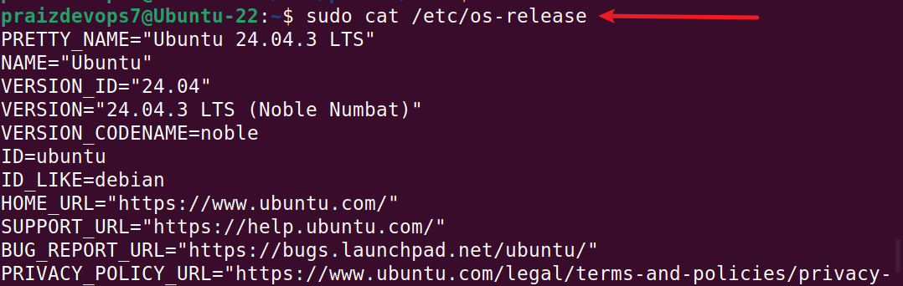

Displays the content of <code>os-release</code> file in the <code>/etc/</code> directory

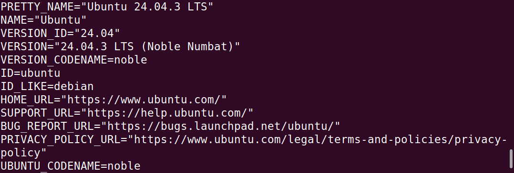

<h5>cp command</h5>

Use the <code>cp</code> command to copy files or directories and their content. Take a look at the following use cases.

To copy one file from the current directory to another, enter <code>cp</code> followed by the file name and the destination directory. For example:

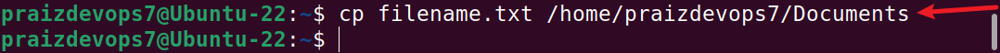

This will copy <code>filename.txt</code> into the <code>/home/ubuntu/Documents</code> directory. If you list the directory, you will find the file copied there.

To copy multiple files to a directory, enter the file names followed by the destination directory:

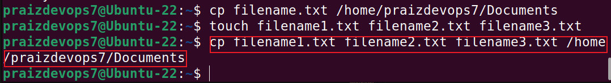

To copy the content of a file to a new file in the same directory, enter <code>cp</code> followed by the source file and the destination file:

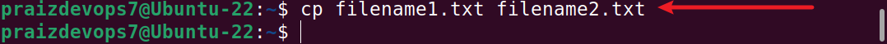

To copy an entire directory, pass the -R flag before typing the source directory, followed by the destination directory:

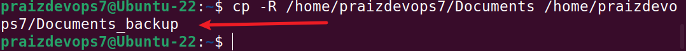

<h5>mv command</h5>

The primary use of the mv command is to move and rename files and directories. Additionally, it doesn’t produce an output upon execution.

Simply type <code>mv</code> followed by the filename and the destination directory. For example, you want to move <code>filename.txt</code> to the <code>/home/ubuntu/Documents</code> directory:

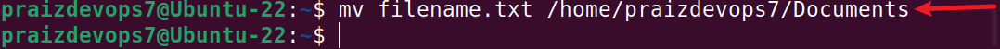

You can also use the <code>mv</code> command to rename a file:

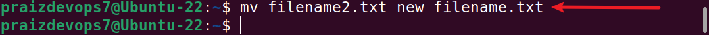

<h5>rm command</h5>

The rm command is used to delete files within a directory.

<strong>Caution:</strong> This is a very dangerous command as it deletes the files completely. So must be used with care.

To remove a single file:

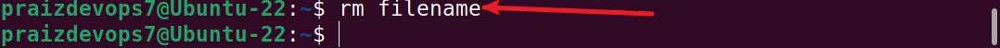

To remove multiple files, enter the following command:

Here are some acceptable options you can add:

<pre class="relative"><button type="button" class="absolute right-2 top-1.5 flex items-center gap-1 rounded-md border border-blue-300 bg-inherit px-2 py-1.5 text-sm font-medium text-blue-300"><svg width="21" height="21" viewBox="0 0 21 21" fill="none" xmlns="http://www.w3.org/2000/svg"><path d="M15.3677 8.03125L17.3677 8.03125C17.92 8.03125 18.3677 8.47896 18.3677 9.03125L18.3677 16.0312C18.3677 17.1358 17.4722 18.0312 16.3677 18.0312L9.36768 18.0312C8.81539 18.0312 8.36768 17.5835 8.36768 17.0312L8.36768 15.0312M10.3677 2.03125L4.36768 2.03125C3.26311 2.03125 2.36768 2.92668 2.36768 4.03125L2.36768 10.0312C2.36768 11.1358 3.26311 12.0312 4.36768 12.0312L10.3677 12.0312C11.4722 12.0312 12.3677 11.1358 12.3677 10.0312L12.3677 4.03125C12.3677 2.92668 11.4722 2.03125 10.3677 2.03125Z" stroke="currentColor" stroke-width="1.5" stroke-linecap="round"></path></svg>Copy</button><code>-i prompts system confirmation before deleting a file. (Denotes "interractive")
-f allows the system to remove without a confirmation. (Denotes "force")
-r deletes files and directories recursively.
</code></pre>

<h5>touch command</h5>

The touch command allows you to create an empty file.

For example, enter the following command to create an HTML file named Web in the Documents directory:

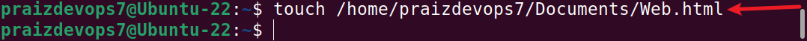

<h5>find command</h5>

Use the find command to search for files within a specific directory and perform subsequent operations. Here’s the general syntax:

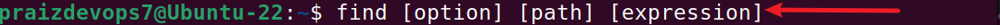

For example, you want to look for a file called <code>notes.txt</code> within the home directory and its subfolders:

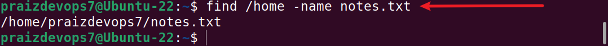
